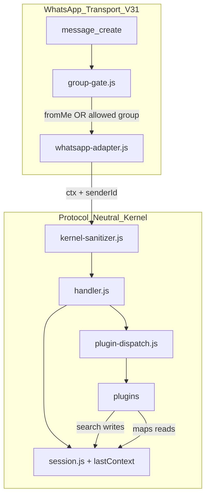
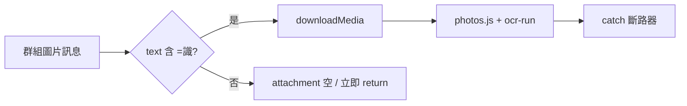

# 專案整體架構表（Version 3.1 — 黑貓輕量 OS · 群組聯動特區）

> 客戶需求見 **[V31OS需求文件.md](./V31OS需求文件.md)**  
> 分階 Checklist 見 **[docs/PHASES_v31.md](./docs/PHASES_v31.md)**  
> 工作日誌見 **[V31OS工作記錄.md](./V31OS工作記錄.md)**  
> V3.0 基線架構見 [V3OS專案架構.md](./V3OS專案架構.md)

---

## 〇、版本線與隔離（繼承 V3）

| 版本 | 路徑 | 關係 |
|------|------|------|
| v1 | `whatsapp_calculator/` @ `v1.0.0` | **只讀**複製源；禁止回寫 |
| v2 | 同上 @ `v2.0.0` | **只讀**引用文件 |
| **v3.0** | `whatspp_Blackcat_OS/` Phase 0～9 | 已驗收基線 |
| **v3.1** | 同 repo Phase 10～14 | **增量**；不破壞 v3.0 測試契約 |

**V3.0 里程碑備份（2026-06-09）：**  
`D:\Users\Ophelia Chan\Desktop\MY Project\backups\whatspp_Blackcat_OS_v3.0-milestone_2026-06-09.zip`

隔離鐵律見 `.cursor/rules/v3-isolation.mdc` 與 V3OS專案架構 §一。

---

## 一、V3.1 架構增量總覽



| V3.1 模組 | 職責 | Phase |
|-----------|------|-------|
| `lib/group-gate.js` | `ALLOWED_GROUPS`、`MAX_GROUP_SIZE`、是否允許處理訊息 | 13 |
| `lib/whatsapp-adapter.js` | `principalId` 雙向解析、`senderId`、**條件式** `downloadMedia` | 10、13 |
| `session.appData.lastContext` | 群級討論焦點快取 | 11 |
| `lib/llm-provider.js` | LLM 供應商抽象 | 14 |
| `lib/ocr-run.js` | OCR 斷路器 | 10 |

---

## 二、群組生存合約 — 架構落點

| 合約條款 | 落地位置 |
|----------|----------|
| G1 白名單 | `group-gate.js` ← `process.env.ALLOWED_GROUPS` |
| G2 指令閘門 | `parse.js` + handler：非指令 `UNKNOWN` 且群內他人 → adapter 層已過濾或 handler 不回 |
| G3 禁自動 OCR | `whatsapp-adapter.js` + `routeImageReceipt` |
| G4 ≤6 人 | `group-gate.js` ← `MAX_GROUP_SIZE`（預設 6） |
| G5 群級 context | `session.js` `appData.lastContext` keyed by `principalId` |
| G6 senderId | `ctx.senderId`；`kernel-sanitizer` 保留 |
| G7 BYOK | 既有 `search-llm` → Phase 14 `llm-provider` |
| G8 無 Redis | `session` in-memory `Map` |

---

## 三、Transport 訊息閘門（V3.1 定案）

### V3.0（現況）

```javascript
client.on('message_create', async (msg) => {
  if (!msg.fromMe) return;
  // ...
});
```

### V3.1（目標）

```javascript
client.on('message_create', async (msg) => {
  if (!shouldProcessMessage(msg)) return;  // group-gate.js
  // ...
});

// shouldProcessMessage:
//   fromMe → true
//   else → isGroup && chatId in ALLOWED_GROUPS && body starts with '=' (or parseable command)
```

**保留 `message_create`**，不新增 `message` 監聽，避免雙路重複與 Phase 8 契約衝突。

### `principalId` 解析（群組）

| `fromMe` | `principalId` |
|----------|----------------|
| `true`（本人發到群） | `String(msg.to)` |
| `false`（他人在群） | `String(msg.from)` |
| 私聊 | `String(msg.from)` 或 `msg.to`（與 V3.0 一致） |

### `senderId` 解析

```javascript
const senderId = msg.isGroup
  ? String(msg.author || msg.id?.participant || '')
  : String(msg.fromMe ? msg.to : msg.from);
```

---

## 四、中立 `ctx` 鋼鐵合約（V3.1 擴充）

```javascript
const ctx = {
  source: 'WHATSAPP',
  principalId: '…@g.us',      // session 隔離；lastContext 歸屬
  senderId: '…@c.us',         // V3.1 新增；日誌／未來審計
  text: '=地圖',
  attachment: {
    hasAttachment: false,
    type: 'TEXT',
    payload: '',
  },
};
```

`handler`／`plugins` **仍禁止** `msg.`、`client.`、`downloadMedia`。

---

## 五、`lastContext` 資料形狀（Phase 11）

```javascript
// session.appData.lastContext — 每 principalId 一份
{
  kind: 'SEARCH',           // SEARCH | MAPS | …
  query: '銅鑼灣 日式',      // maps 盲操讀此欄
  updatedAt: 1717880000000, // epoch ms
  triggeredBy: '8529…@c.us' // 可選；審計用，不影響 maps 讀取
}
```

**寫入：** `search.js` 在 L0/L1/L2 成功回覆前  
**讀取：** `maps.js` 當 `cmd.payload` 為空且指令為 `=地圖`  
**清除：** `releaseToIdle` 不強制清除（焦點跨指令保留）；`=結束` 可選清除（Phase 11 文件化）

---

## 六、多媒體防線（Phase 10）



| 層級 | 行為 |
|------|------|
| Adapter | 無 `=識` → 不 `downloadMedia` |
| Handler | `routeImageReceipt` 僅 `SYS_PHOTOS`／明確 OCR 路由 |
| OCR | `try/catch`；失敗 → `photosOcrFailed` 文案 |
| Dispatch | 既有 8 秒超時保留 |

---

## 七、目錄結構（V3.1 目標）

在 V3.0 Phase 9 樹狀基礎上**追加**：

```
whatspp_Blackcat_OS/
├── V31OS需求文件.md
├── V31OS專案架構.md          # 本文件
├── V31OS工作記錄.md
├── V3OS需求文件.md           # 歷史基線（保留）
├── V3OS專案架構.md
├── V3OS工作記錄.md
├── index.js                  # Phase 13：group-gate 整合
├── lib/
│   ├── group-gate.js         # Phase 13 新增
│   ├── llm-provider.js       # Phase 14 新增
│   ├── whatsapp-adapter.js   # Phase 10/13 修改
│   ├── ocr-run.js            # Phase 10 斷路器
│   ├── session.js            # Phase 11 lastContext 欄位
│   ├── kernel-sanitizer.js   # Phase 13 senderId
│   └── plugins/
│       ├── search.js         # Phase 11 寫 lastContext
│       ├── maps.js           # Phase 11 讀 lastContext
│       └── calendar.js       # Phase 11 可選 NLP
├── config/
│   └── tools-menu.json       # Phase 12 第 8 項 AI
├── docs/
│   ├── PHASES_v3.md          # 歷史
│   └── PHASES_v31.md         # V3.1 原子 Phase
└── test/
    ├── phase_v31_10_check.py … phase_v31_14_check.py
    ├── phase11_northstar.test.js
    ├── group_gate.test.js
    └── verify_v31.py         # 累加 10～14（或擴充 verify_v3.py）
```

---

## 八、Handler 路由優先序（V3.1 不變）

```
PROMPT_GUARD
  → GAME_PLAYING（鋼鐵特權）
  → Fast-track（=查、=地圖、=識…）
  → 圖片 OCR（僅 =識 / SYS_PHOTOS；Phase 10 收緊）
  → Tools Hub（Phase 12：含第 8 項 AI）
  → …（其餘同 V3.0）
```

---

## 九、環境變數（V3.1 新增）

| 變數 | 預設 | 說明 |
|------|------|------|
| `ALLOWED_GROUPS` | （空） | 逗號分隔群 ID；空 = 僅 `fromMe` |
| `MAX_GROUP_SIZE` | `6` | 軟上限；超過可拒絕非 fromMe 指令 |
| `AI_API_KEY` | （空） | BYOK；Phase 14 經 `llm-provider` |
| `RAILWAY_PUBLIC_DOMAIN` | （空） | 郵件手機連結（V3.0 已有） |

---

## 十、測試分層（V3.1）

| 層級 | 腳本 | 說明 |
|------|------|------|
| 硬編碼 | `audit_hardcode.py` | 每 Phase 必跑 |
| v1 回歸 | `verify.py` | 計算機不 regression |
| v3.0 累加 | `verify_v3.py` | Phase 0～9 |
| **v3.1 累加** | `verify_v31.py` 或擴充 `verify_v3.py` | Phase 10～14 |
| 單階 | `phase_v31_N_check.py` | 對照 `PHASES_v31.md` Checklist |
| 北極星 | `phase11_northstar.test.js` | 上下文鏈 E2E |
| Transport | `transport_v3.test.js` | Phase 13 更新白名單案例 |

### Phase 8/9 契約變更聲明

| 原 V3.0 測試 | V3.1 行為 |
|--------------|-----------|
| `fromMe: false` 一律無回覆 | **預設仍無回覆**（未設 `ALLOWED_GROUPS`） |
| — | 設白名單 + `=查` → **有回覆** |

驗收腳本須**分支**：無 env 時保持 V3.0 斷言；有 `ALLOWED_GROUPS` mock 時測群組路徑。

---

## 十一、Phase 路線（V3.1）

| Phase | 主題 | 依賴 |
|-------|------|------|
| **10** | OCR 斷路器 + 媒體指令閘門 | V3.0 Phase 9 |
| **11** | `lastContext` + 北極星鏈 | 10 |
| **12** | Tools Hub AI 第 8 項 | 11（建議） |
| **13** | 群組生存合約（gate + senderId） | 10 |
| **14** | `llm-provider` 抽象 | 12 |

**建議實作順序：** `10 → 11 → 13 → 12 → 14`（先穩定再開群，再擴 AI 入口，最後抽象 LLM）。

---

## 十二、與 V3.0 模組對照（不刪除）

| 模組 | V3.0 | V3.1 變更 |
|------|------|-----------|
| `index.js` | 僅 fromMe | + `group-gate` |
| `whatsapp-adapter.js` | 無條件下載圖 | 條件下載 + senderId |
| `session.js` | 無 lastContext | + `appData.lastContext` |
| `maps.js` | 必須帶地點 | 可盲操 |
| `search.js` | 不寫 context | 寫 lastContext |
| `search-llm.js` | 直連 OpenAI | 委派 `llm-provider` |

---

*V31OS專案架構 — Version 3.1 — 2026-06-09*
