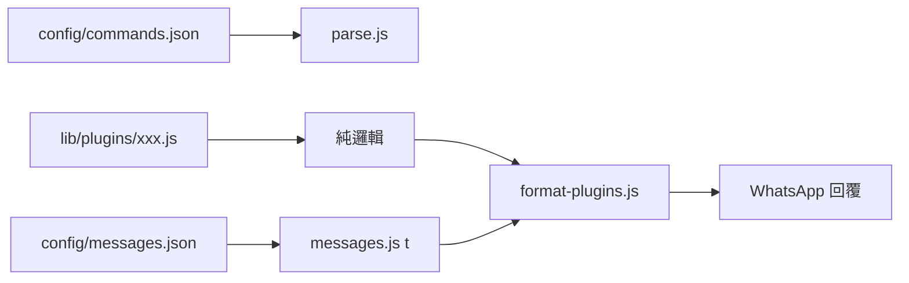
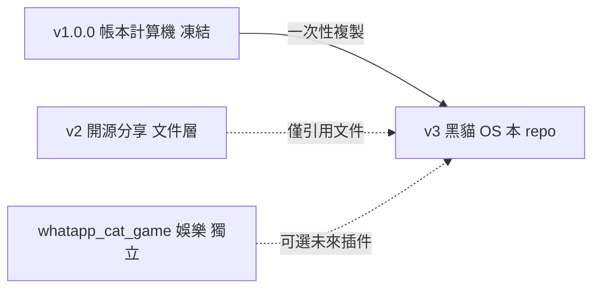
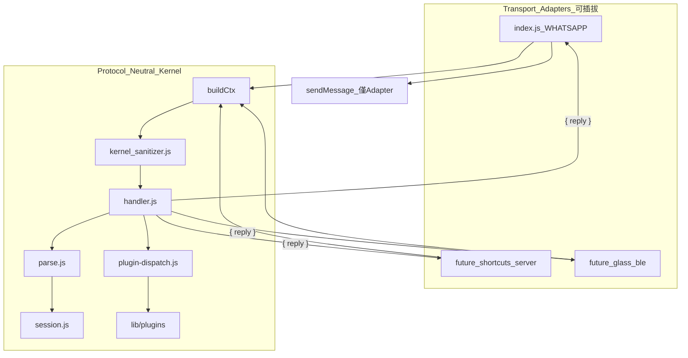

# 專案整體架構表（Version 3 — 黑貓輕量 OS）

> 客戶需求見 **[V3OS需求文件.md](./V3OS需求文件.md)**  
> 工作日誌見 **[V3OS工作記錄.md](./V3OS工作記錄.md)**  
> 微核心源自 [whatsapp_calculator](../whatsapp_calculator) Version 1（`v1.0.0`）

---

## 〇、首要解決項：硬編碼禁令（Phase 0 閘門，絕不容許）

> **任何插件、任何 Phase 開工前，必先通過硬編碼稽核。**  
> 未通過 → **不得**宣稱 Phase 完成、**不得**進入下一 Phase、**不得**合併程式。  
> 規範來源：[whatsapp_calculator/README.md](../whatsapp_calculator/README.md)、[專案整體架構表.md §8.2](../whatsapp_calculator/專案整體架構表.md)

### 禁令（人類與 AI 均須遵守）

1. **禁止**在 `lib/`、`lib/plugins/` 以引號字串硬編碼 `config/` 內已定義的**指令別名**或**使用者可見回覆文案**  
2. **禁止**在插件 Mock 階段把示範回覆寫死在 `.js`；Mock 文案須在 `config/messages.json`（或 `config/fixtures/`）  
3. **禁止**在 `lib/` 硬編碼應由設定檔驅動的內容：`email-routes`、`search-prompts`、插件別名等  
4. **禁止**因趕進度跳過 `audit_hardcode.py`；**禁止**僅口頭宣稱「沒硬編碼」  
5. WhatsApp **回覆給使用者**的文字 → 一律 `t(locale, key)` 或同級設定驅動 API；`lib/` 只組裝邏輯與變數  

### 允許例外（不視為違規）

| 類型 | 範例 | 說明 |
|------|------|------|
| 終端機／開發 log | `[game]`、`機器人已就緒` | 非 WhatsApp 使用者可見回覆 |
| 程式常數 | `'UNKNOWN'`、`@g.us` | 內部型別／協議，非文案 |
| 註解 | 中文說明 | 不進入引號稽核 |

### 設定檔職責（V3 擴充版）

| 檔案 | 不得寫入 `lib/` 的內容 |
|------|------------------------|
| `config/commands.json` | 所有指令別名（`=查`、`=email`、`=開始`…） |
| `config/messages.json` | 所有語系回覆、錯誤、Mock 成功訊息 |
| `config/email-routes.json` | 收件人暱稱映射 |
| `config/search-prompts.json` | LLM Prompt 模板 |

### 稽核機制（Phase 0 必備）

自 [whatsapp_calculator/test/audit_hardcode.py](../whatsapp_calculator/test/audit_hardcode.py) 移植並加強：

| 項目 | 要求 |
|------|------|
| 掃描範圍 | `lib/*.js` + **`lib/plugins/*.js`** |
| 白名單來源 | `commands.json`、`messages.json`；Phase 0 後加入 routes／prompts |
| 通過標準 | 終端機 `RESULT: [PASS]` |
| 整合 | 納入 `test/verify_v3.py`；**與 v1 回歸 `verify.py` 並列必跑** |

```powershell
python test\audit_hardcode.py   # 必須 PASS
python test\verify_v3.py          # Phase 0 起
python test\verify.py             # v1 計算機回歸（若已移植核心）
```

### 正確模式（強制）



### 已知反面教材（開工前須避免重犯）

| 專案 | 問題 |
|------|------|
| [whatapp_cat_game](../whatapp_cat_game) `game-format.js` | `Score:`、`準備：`、`瞄準盤：` 等寫死在 lib，未全數進 `game-messages.json` |
| 未建 audit | 泡泡龍專案尚無 `audit_hardcode.py`，易在 V3 十插件時大規模復發 |

**V3 策略：** Phase 0 **只做**稽核骨架 + config 契約 + 移植 v1 核心；**確認 audit PASS 後**才允許新增第一個插件檔案。

---

## 專案名稱

**WhatsApp 黑貓輕量 OS** — 微核心 + 可插拔插件（ChatOps Kernel）

---

## 一、版本演進與隔離保證



| 版本 | Repo 路徑 | Git | v3 與其關係 |
|------|-----------|-----|-------------|
| **v1** | `whatsapp_calculator/` | `v1.0.0` tag、`version-1` 分支 | **只讀複製源**；Phase 0 **禁止**回寫 |
| **v2** | 同上（`v2.0.0` tag、`main`） | 文件／腳本層 | **只讀引用** `SHARING.md` 等；**禁止**改 v2 核心 |
| **v3** | `whatspp_Blackcat_OS/` | **獨立** repo（與 v1 分開） | **唯一**可改程式之目錄 |

### 隔離鐵律（Phase 0 起強制）

| # | 規則 | 原因 |
|---|------|------|
| 1 | **所有 v3 程式只寫在** `whatspp_Blackcat_OS/` | 與 v1/v2 實體分目錄 |
| 2 | **禁止**修改 `whatsapp_calculator/lib/`、`index.js` | v1 核心凍結；v2 亦同 |
| 3 | **禁止** symlink、`npm link`、`file:../whatsapp_calculator` 共用執行檔 | 避免 v3 改動連動 v1 |
| 4 | Phase 0 採 **一次性複製**（copy）v1 檔案進 v3；之後兩邊**各自演進** | 複製 ≠ 連結 |
| 5 | v3 回歸用 **v3 目錄內** 的 `test/verify.py`（自 v1 複製的一份） | 在 v3 cwd 跑，**不**在 v1 目錄跑 v3 測試 |
| 6 | 可選：每次 Phase 結束在 **v1 目錄** 跑 `python test/verify.py` 確認 v1 **未被意外改動** | 雙向保險 |

**還原對照：**

```powershell
# 確認 v1 仍為凍結基準（應在 whatsapp_calculator 目錄執行）
cd "D:\Users\Ophelia Chan\Desktop\MY Project\whatsapp_calculator"
git checkout v1.0.0
python test\verify.py

# v3 開發（應在 whatspp_Blackcat_OS 目錄執行）
cd "D:\Users\Ophelia Chan\Desktop\MY Project\whatspp_Blackcat_OS"
python test\phase_v3_0_check.py
```

| 版本 | 產出 | 本 repo |
|------|------|---------|
| v1 | `calc` / `parse` / `handler` / `session` | 凍結；僅供 v3 **複製** |
| v2 | 分享文件、`setup-windows.ps1` | 可引用，**不重複實作、不修改** |
| v3 | `lib/plugins/*`、`plugin-dispatch` | **本專案主體** |

---

## 二、微核心概述

| 項目 | 說明 |
|------|------|
| 目的 | 以**插件**完成計算、搜尋、郵件、筆記等工作流；首發殼為 WhatsApp，架構**不綁定** WhatsApp |
| I/O（首發） | WhatsApp Web（`whatsapp-web.js`）— 僅為 **Transport Adapter** 之一 |
| 核心職責 | 解析指令、隔離 Session、路由插件、回傳**純文字** `{ reply }` |
| 原則 | **設定驅動**；**Executor 焊死、Selector 可換**；內核與傳輸協議 **解耦** |
| 程式結構 | 原子化；核心 + 每插件單檔 ≤ 150 行 |

**鋼鐵公理：** 不論原料來自 WhatsApp 引用、iPhone 捷徑或未來 AR 眼鏡 BLE，[`handler.js`](./lib/handler.js) 只認標準化後的 **`ctx`**；插件只讀 `ctx.attachment.payload`（string），**不知道**什麼叫 WhatsApp。

---

## 三、系統資料流（Transport Adapter + 中立內核）



| 層級 | 職責 | 禁止事項 |
|------|------|----------|
| **Adapter**（`index.js`、未來 `adapters/*`） | `fromMe` 過濾、`getQuotedMessage`、組裝 `ctx`、呼叫 `handleMessage`、**唯一**負責 `sendMessage` | 不得在 adapter 內寫業務路由 |
| **Sanitizer**（`kernel-sanitizer.js`） | 多模態原料 → `attachment.payload` **純字串**；長度／控制字元防線 | 插件不得自行解析 JSON 原料 |
| **Kernel**（`handler`／`session`／`plugins`） | 狀態機、路由、插件執行；回 `{ reply: string \| null }` | **禁止** `msg.`、`client.`、`eval`、動態 `require` |

---

## 四、目錄結構（規劃）

```
whatspp_Blackcat_OS/
├── V3OS需求文件.md
├── V3OS專案架構.md
├── V3OS工作記錄.md
├── index.js                      # WhatsApp Transport Adapter（Phase 3 骨架 → Phase 7 完整）
├── package.json
├── adapters/                     # 未來：捷徑／PWA／眼鏡（Phase 7+，首發不建）
│   ├── shortcuts-server.js       # 規格伏筆
│   └── glass-ble.js
├── config/
│   ├── commands.json
│   ├── messages.json
│   ├── menu.json
│   ├── plugins.json              # 含 supported_sources 契約
│   ├── email-routes.json
│   └── search-prompts.json
├── lib/
│   ├── ctx-contract.js           # SOURCE／attachment 枚舉（Phase 0）
│   ├── kernel-sanitizer.js       # 多模態標準化（Phase 1）
│   ├── plugin-dispatch.js
│   ├── plugins/
│   │   ├── maps.js
│   │   ├── translate.js
│   │   ├── notes.js
│   │   └── …
│   ├── handler.js
│   ├── session.js
│   ├── parse.js
│   └── calc.js（v1 凍結）
├── docs/
│   └── PHASES_v3.md
└── test/
    ├── audit_hardcode.py
    ├── verify.py
    └── verify_v3.py
```

---

## 五、核心模組職責

| 模組 | 職責 | 行數上限 |
|------|------|----------|
| `index.js` | **WhatsApp Adapter**：`message_create`、fromMe 過濾、`buildCtxFromWhatsApp(msg)`、`sendMessage(result.reply)` | ≤150 |
| `ctx-contract.js` | `SOURCE`／`ATTACHMENT_TYPE` 常量；`ctx` 形狀文件化 | ≤30 |
| `kernel-sanitizer.js` | `normalizeCtx(ctx)` → `attachment.payload` 必為 string | ≤40 |
| `handler.js` | 入口呼叫 sanitizer；路由優先序；回 `{ reply }`；**不接** WhatsApp API | ≤150 |
| `plugin-dispatch.js` | 依 `cmd.type` 載入 `plugins/*.execute`；8 秒超時斷路器 | ≤150 |
| `parse.js` | exact / prefix / OPERATION；Payload 長度防線；`GLASS_AUDIO` Token Guard 預留 | ≤150 |
| `session.js` | `principalId` 隔離；`osState`／`appData`；`meta.activeSource` 多軌鎖骨架 | ≤150 |
| `calc.js` | 帳本計算（**v1 運算邏輯不變**） | 凍結 |
| `lib/plugins/*.js` | 單一插件；只讀 `ctx.attachment.payload`（string） | ≤150 |

---

## 六、中立 `ctx` 鋼鐵合約（Phase 1 定案）

```javascript
// lib/ctx-contract.js — handler / plugins 唯一輸入契約
const ctx = {
  source: 'WHATSAPP',           // WHATSAPP | SHORTCUTS | GLASS_BLE | PWA_APP | GLASS_AUDIO
  principalId: 'user_123_hk',   // session 隔離鍵；WhatsApp 期 principalId = chatId
  text: '=地圖 銅鑼灣',
  attachment: {
    hasAttachment: true,
    type: 'TEXT',               // TEXT | IMAGE | AUDIO
    payload: '純文字原料'        // Sanitizer 洗淨後；插件只吃 string
  }
};
```

**內核回傳：**

```javascript
// handler.handleMessage(ctx) → Adapter 負責發送
{ reply: string | null }
```

**插件契約：**

```javascript
function execute(cmd, session, ctx) {
  // 讀 ctx.text、ctx.attachment.payload（string only）
  return '回覆字串' | null;
}
```

**稽核鐵律：** `lib/handler.js`、`lib/plugins/` 不得出現 `msg.`、`client.`、`sendMessage`、`getQuotedMessage`、`eval(`。

---

## 七、Session 結構（擴充）

`SYS_*` 指令**不得**要求 `session.active === true`（計算機專用）。

```javascript
{
  principalId: string,
  locale: string,
  osState: 'IDLE' | 'MENU' | 'APP_ACTIVE' | 'TOOLS_HUB' | 'GAME_HUB' | 'GAME_PLAYING' | 'PROMPT_GUARD',
  currentApp: string | null,
  guard: object | null,
  appData: { calc: { entries, total }, notes: [], … },
  meta: {
    activeSource: 'WHATSAPP',   // 多軌互斥鎖（Phase 1 骨架）
    lockReason: null            // 'CALC' | 'GAME_PLAYING' | null
  }
}
```

**多軌策略（規格伏筆）：** CALC 多輪中，外來源（`SHORTCUTS`／`GLASS_BLE`）One-shot → 回 `messages.sourceBusy` 優雅拒絕；首發僅 `WHATSAPP` 進線，mutex  dormant。

---

## 八、指令對照（zh-TW 摘要）

見 [V3OS需求文件.md](./V3OS需求文件.md) 插件藍圖表。

---

## 九、三層驅動模型

| 層級 | 名稱 | 技術 |
|------|------|------|
| **L1** | 雲端 API | HTTPS + BYOK |
| **L2** | 黑貓資料層 | session + 檔案／DB |
| **L3** | 本機橋接 | Shortcuts／PWA／眼鏡 → **新 Adapter** 組同一 `ctx` |

### 訓練輪（規格伏筆，首發不實作）

| 訓練輪 | 新增檔案 | 內核改動 |
|--------|----------|----------|
| iPhone 捷徑 | `adapters/shortcuts-server.js` | **零** |
| 手機相機 OCR | 捷徑或 PWA adapter | **零** |
| Apple Watch 數字 | 等同 MENU 選項 | **零** |
| 開源 AR 眼鏡 | `adapters/glass-ble.js` | **零** |

驗收：新增 adapter 後，既有 `verify_v3.py` 與 plugin 測試 **無 diff 通過**。

---

## 十、分階實作（V3 Phase 0～7）

完整 Checklist 見 **[docs/PHASES_v3.md](./docs/PHASES_v3.md)**。

| Phase | 主交付 | 驗證 |
|-------|--------|------|
| **0** | 骨架 + v1 複製 + `audit` + `ctx-contract.js` + `plugins.json`（`supported_sources`） | `phase_v3_0_check.py` |
| **1** | 狀態機 + `kernel-sanitizer` + handler 回 `{ reply }` + source mutex 骨架 | `phase_v3_1_check.py` |
| **2** | maps L0 + translate Mock + 4 項 menu + game_hub Mock | `phase_v3_2_check.py` |
| **3** | `index.js` WhatsApp Adapter + `notes.js`（`attachment.payload`） | `phase_v3_3_check.py` |
| **4～7** | 搜尋／郵件／Tools Hub／泡泡龍合流 | 見 PHASES_v3.md |

---

## 十一、部署與環境變數

見 [V3OS需求文件.md](./V3OS需求文件.md)。

---

## 十二、風險與緩解

| 風險 | 緩解 |
|------|------|
| **硬編碼復發（最高優先）** | Phase 0 閘門；見 **§〇** |
| **WhatsApp 滲透內核** | `audit` 禁止 plugins 引用 `msg.`／`client.`；Adapter 外置 |
| **多軌併發幽靈狀態** | `session.meta.activeSource` + `sourceBusy` 拒絕策略 |
| **IPC 代碼注入** | Sanitizer 長度上限；禁止 `eval`／動態 `require` |
| Token 費用 | BYOK + 瀑布降級 |
| v1 回歸失敗 | 每 Phase 跑 `verify.py` |

---

## 十三、與姊妹專案關係

| 專案 | 角色 |
|------|------|
| [whatsapp_calculator](../whatsapp_calculator) | v1 源頭 |
| [whatapp_cat_game](../whatapp_cat_game) | 泡泡龍獨立 bot |

---

## 相關文件（V3OS 三件套）

| 文件 | 連結 |
|------|------|
| 需求規格 | [V3OS需求文件.md](./V3OS需求文件.md) |
| 工作記錄 | [V3OS工作記錄.md](./V3OS工作記錄.md) |
| v1 架構 | [../whatsapp_calculator/專案整體架構表.md](../whatsapp_calculator/專案整體架構表.md) |

---

*V3OS專案架構 — Version 3 — 2026-06-06（Protocol-Neutral ctx 合約追加）*
